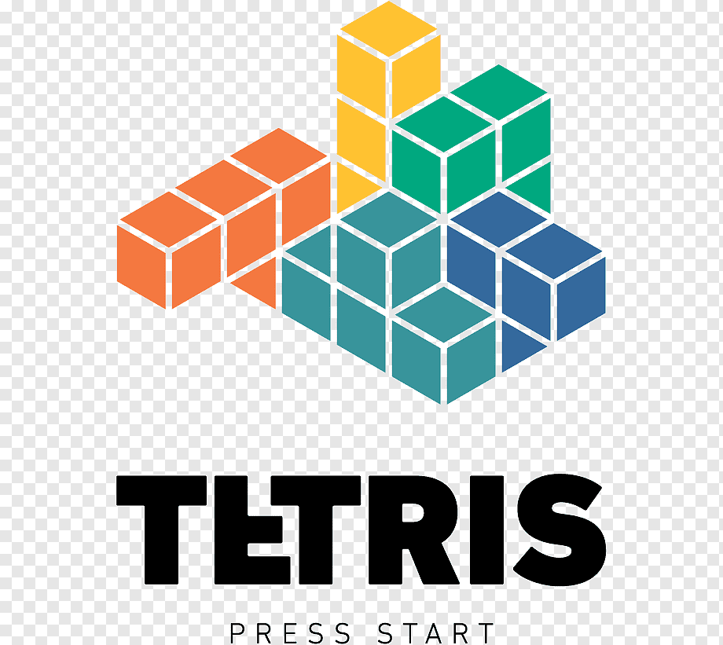

# Foobar
ENCE260 UCFK4 Assignment

# Game
##  BATTLESHIPS
```Bash
1. A 2-player battleships game developed to run on the UCFK4 micro-controller.
```

# Authors
Scott Li (gli65@uclive.ac.nz), Sam Heslip (she119@uclive.ac.nz)

# Date Started
29/09/2020

# How to start game
From within this directory, the following commands can be run

- `make`: Compiles source code and builds object files
- `make program`: Runs `make` and then loads program into UCFK4 flash memory
- `make clean`: Remove old object files from directory

Run `make program` to start playing!

# How to play game

## 4 ship models
1. Three length `'L'` ship 
2. Three length `'I'` ship 
3. Two length `'i'` ship 
4. One length `'O'` ship 
- `There are 5 ships in total, 1 L, 1 I, 1 i, 2 O ship.`
- 1.**Placing The Ships**: From the loading screen, press the button to begin placing the ships. Use the nav switch to move your ship around the board, and use the button to rotate ships 90 degrees. Place ships by pressing the button (the white switch near R7) down. Once all ships have been placed,  it will automatically go the next step.
- 2.**Strike Stage**: Move the cursor around the screen with the board with the nav switch, and push the nav switch to fire. Shows if the hit was successful and is then taken to a hold screen waiting for the other player.
- 3.**End Of Game**: When a player sinks all other players' ships, he wins the game. When prompted, press the button to play again!
