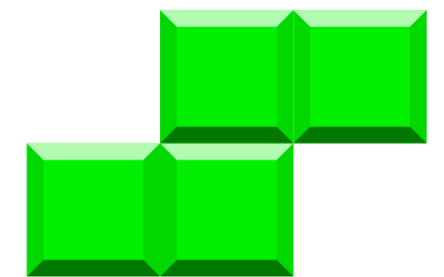
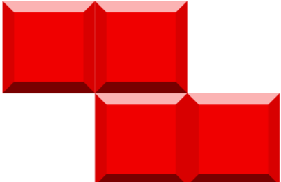
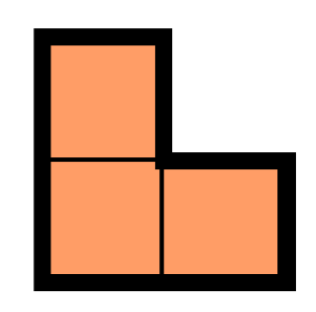
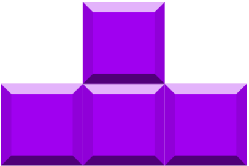

# Foobar
ENCE260 UCFK4 Assignment

# Game
##  
## TETRIS
```Bash
1. A 2-player TETRIS game developed to run on the UCFK4 micro-controller.
```

# Authors
Scott Li (gli65@uclive.ac.nz), Sam Heslip (she119@uclive.ac.nz)

# Date Started To end
29/09/2020 - 11/10/2020

# How to start game
From within this directory, the following commands can be run

- `make`: Compiles source code and builds object files
- `make program`: Runs `make` and then loads program into UCFK4 flash memory
- `make clean`: Remove old object files from directory

Run `make program` to start playing!

# How to play game

## `7` Tetronimo model
1. Four length `'+'` ship 
2. Four length `'S'` ship 
3. Four length `'Z'` ship 
4. Three length `'L'` ship 
5. Three length `'T'` ship 
6. Three length `'I'` ship 
7. Two length `'i'` ship 

- `1`.**Start The Game**:  Firstly, The display shows `'BATTLESHIPS'` (It means the game has started). Next, it will show `'Push to connect'` Now A player can click the button (the white switch near R7) down to be a player 1 other is player 2.
- `2`.**Placing The Ships**: From the loading screen, press the button to begin placing your ships. Use the nav switch to move your ship around the board, and use the button to rotate ships 90 degrees. Place ships by pressing the button (the white switch near R7) down. Once all ships have been placed,  it will automatically go the next step.
- `3`.**Wait For Player Turn**: The player 1 display shows `'Your turn'` and The player 2 display shows `'waiting for hit..'` or `'Opponents turn'`, The player 1 to do the step 4. and player 2 waiting for player 1 and then is plyer 2 turn to hit.
- `4`.**Strike Stage**: Move the cursor around the screen with the board with the nav switch, and push the nav switch to fire. Shows if the hit was successful and is then taken to a hold screen waiting for the other player.
- `5`.**End Of Game**: When a player sinks all other players' ships, he wins the game. When prompted, press the button to play again!