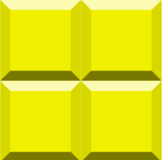

# Foobar
ENCE260 UCFK4 Assignment

# Game
##  
## TETRIS
```Bash
1. A 2-player TETRIS game developed to run on the UCFK4 micro-controller.
```
# Aim Of Game
```Bash
- In Tetris, players must complete lines by moving differently shaped pieces (tetrominoes), which descend onto the playing field. The completed lines are send to the other player to make their life hard and the player can proceed to fill the vacated spaces. The game ends when the playing field is overloaded with Tetronimos. 
```

# Authors
Scott Li (gli65@uclive.ac.nz), Sam Heslip (she119@uclive.ac.nz)

# Date Started To end
29/09/2020 - 12/10/2020

# How to start game
From within this directory, the following commands can be run

- `make`: Compiles source code and builds object files
- `make program`: Runs `make` and then loads program into UCFK4 flash memory
- `make clean`: Remove old object files from directory

Run `make program` to start playing!

# How to play game

## `7` Tetromino model
1. Four length `'+'`  
2. Four length `'S'`  
3. Four length `'Z'`  
4. Three length `'L'` 
5. Three length `'T'` 
6. Three length `'I'` 
7. Two length `'i'`   

- `1`.**Start The Game**: The game start display shows `'Push nav button to start'`, Next push the nav switch to start.
- `2`.**Run Stage**: Move the Tetronimo around the screen with the nav switch. Left button and navswitch push rotate the Tetronimo anticlockwise and clockwise. Navswitch down slams the Tetroinmo to the ground.
- `3`.**End Of Game**: When a players Tetronimo tower grows above the screen, they lose. Aim to stay low. On this screen the number of wins is displayed. Push nav switch to start a new game!